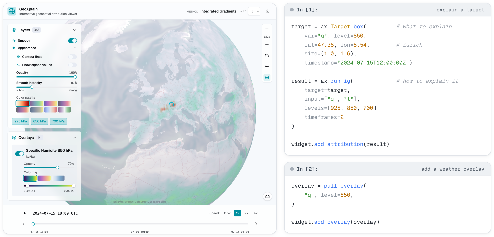

# GeoXplain

| **[GeoXplain][geoxplain-link]** | [GeoXplain Aurora Adapter][aurora-link] | [Documentation][docs-link] | [Live demo][demo-link] | [Paper][paper-link] |
| --- | --- | --- | --- | --- |
| **Current repository** | Aurora backend | User guide and API | Hosted viewer | Manuscript |

<p align="center">
  
</p>

GeoXplain is an interactive Python-based visualization toolkit for exploring geospatial attribution maps
across climate variables, atmospheric pressure layers, and forecast time. It turns
computed attribution arrays, saved result bundles, targets, timestamps, vertical
levels, and weather overlays into an interactive Jupyter widget or a standalone
browser viewer.

The core package does not compute explanations and does not need to import your
model. It is the visualization and interchange layer. Compute can happen
anywhere: in your own pipeline, in a batch job, in another library, or through a
backend such as the separate Aurora adapter.

<details>
<summary><strong>Cite us</strong></summary>

Will be published shortly.

</details>

## Why GeoXplain

- Inspect geospatial attributions across variables, levels, methods, and time.
- Import raw NumPy arrays, `.xia.npz` attribution bundles, or compatible Python
  result objects.
- Add weather-field overlays from `.overlay.npz` bundles or compatible overlay
  objects.
- Work inside notebooks with `GeoXplainWidget` or export a self-contained
  static browser view with `GeoXplain`.
- Keep model-specific compute code out of the viewer package.

## Import computed data

The most portable GeoXplain workflow is to compute explanations somewhere else
and import the result. A saved `.xia.npz` bundle is self-describing, so the
viewer can recover method names, timestamps, targets, layer labels, and
attribution grids without the original model package.

> **Quickstart:** a runnable walkthrough of the snippets below, including bundle
> import, manual `.npy` import, and building grids from in-memory NumPy arrays,
> lives in [`examples/quickstart.ipynb`](examples/quickstart.ipynb).

```python
from geoxplain import GeoXplainWidget
from geoxplain.xia_result import load_xia_result

result = load_xia_result("zurich.xia.npz")  # can be found in examples

widget = GeoXplainWidget(title="Ticino attribution", height=720)  # both optional
widget.add_attribution(result)
widget
```

You can also add arrays directly when you already have a computed grid:

```python
import numpy as np
from geoxplain import GeoXplainWidget

saliency = np.load("saliency_700hPa.npy")

widget = GeoXplainWidget(title="Model attribution")
widget.add_attribution(
    saliency,
    pressure_level=700,
    method="Saliency",
    timestamp="2024-03-20T00:00:00Z",
    target=(46.25, 8.75),
)
widget
```

Weather overlays use the same idea:

```python
from geoxplain.overlay_result import load_overlay_result

overlay = load_overlay_result("zurich.overlay.npz")
widget.add_overlay(overlay)
```

## Compute on-the-fly with a backend

When you want GeoXplain to sit next to live explanation computation, use a
backend that produces GeoXplain-compatible results. The first packaged backend
is the separate `geoxplain-aurora-adapter`, which computes attributions and
weather overlays for Microsoft Aurora.

> **Quickstart:** find a runnable walkthrough for on-the-fly computations in
> [`examples/quickstart_on_the_fly.ipynb`](examples/quickstart_on_the_fly.ipynb).

```python
import geoxplain_aurora_adapter as ax
from geoxplain import GeoXplainWidget

target = ax.Target.point(
    var="q",
    level=850,
    lat=46.25,
    lon=8.75,
    timestamp="2024-03-20T00:00:00Z",
)

result = ax.run_saliency(
    target=target,
    input=["t", "q"],
    remote="http://localhost:8765",
)

GeoXplainWidget(result=result, height=720)
```

Without `remote=`, the adapter runs in the current Python process. With a
listener URL, the same call can dispatch work to a GPU workstation, server, or
SLURM-backed service while GeoXplain remains the viewer.

## Installation

```bash
pip install geoxplain
```

This package is only the visualization tool; for on-the-fly computations for
Microsoft Aurora, see [GeoXplain Aurora Adapter][aurora-link].

Screenshot capture is optional:

```bash
pip install "geoxplain[screenshots]"
```

For local documentation and development:

```bash
uv sync --group dev
uv run mkdocs serve
```

## Documentation

The documentation source lives in `docs/` and is built with MkDocs
Material. The deployed documentation is available at [clemenskoprolin.github.io/geoxplain][docs-link].
Useful starting points:

- [Quickstart][quickstart-link]
- [Visualize results][visualize-link]
- [Data model and file formats][data-model-link]
- [Aurora backend overview][aurora-docs-link]
- [Python API reference][api-reference-link]

Quick reference links for LLMs and tooling:

- [LLM documentation map][llms-link]
- [Consolidated generated reference][llms-full-link]
- [Structured API inventory][api-inventory-link]

## Build docs locally

```bash
uv run python docs/_tooling/generate_llm_reference.py
uv run mkdocs build --strict
```


## License

GeoXplain is distributed under the MIT License. See [LICENSE](LICENSE) and
[THIRD_PARTY_NOTICES.md](THIRD_PARTY_NOTICES.md).

[geoxplain-link]: https://github.com/clemenskoprolin/geoxplain
[aurora-link]: https://github.com/clemenskoprolin/geoxplain-aurora-adapter
[docs-link]: https://clemenskoprolin.github.io/geoxplain/
[quickstart-link]: https://clemenskoprolin.github.io/geoxplain/getting-started/quickstart/
[visualize-link]: https://clemenskoprolin.github.io/geoxplain/guides/visualize-results/
[data-model-link]: https://clemenskoprolin.github.io/geoxplain/concepts/data-model/
[aurora-docs-link]: https://clemenskoprolin.github.io/geoxplain/backends/aurora/
[api-reference-link]: https://clemenskoprolin.github.io/geoxplain/reference/geoxplain/
[llms-link]: https://clemenskoprolin.github.io/geoxplain/llms.txt
[llms-full-link]: https://clemenskoprolin.github.io/geoxplain/llms-full.txt
[api-inventory-link]: https://clemenskoprolin.github.io/geoxplain/api-reference.json
[demo-link]: https://ckoprolin.ivia.ch/
[paper-link]: https://example.com/geoxplain-paper
