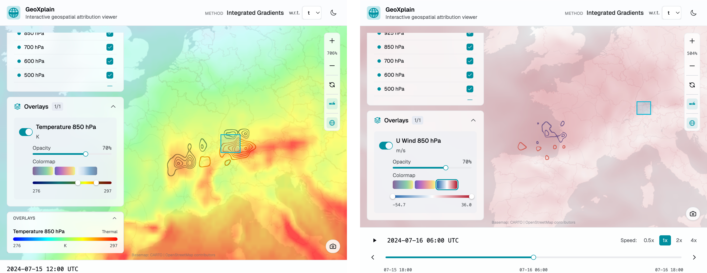

# Add weather overlays

Overlays place a weather field beneath or alongside the attribution rendering. GeoXplain accepts in-memory arrays, saved `.overlay.npz` bundles, and NetCDF variables directly. A compatible model backend may also return an overlay result.



*Overlays give the attribution physical context. Here the attribution is drawn as contour lines on top of a weather overlay: an 850 hPa temperature field (left) and, for a later rollout step, an 850 hPa horizontal wind field (right). Each overlay carries its own colormap, opacity, and value range, set from the overlay panel and configurable through the arguments below.*

## Add an array

```python
widget.add_overlay(
    humidity,
    name="Specific humidity",
    unit="kg/kg",
    timestamps=["2024-03-20T00:00:00Z"],
    colormap="thermal",
    visible=True,
)
```

A two-dimensional array creates one frame. A three-dimensional array is interpreted as `(time, latitude, longitude)` and creates one frame per first-axis element.

`add_overlay()` updates the widget in place and returns `None`; an already-displayed widget refreshes automatically.

## Load a saved overlay

```python
from geoxplain.overlay_result import load_overlay_result

overlay = load_overlay_result("humidity.overlay.npz")
widget.add_overlay(overlay)
```

Metadata from an `OverlayResult` supplies the variable, label, unit, colormap, timestamps, and visibility. `name`, `unit`, `colormap`, `timestamps`, and `visible` may be overridden when adding it; `variable` may not. The producing backend does not need to be installed.

## Add a NetCDF variable

```python
widget.add_overlay(
    "weather.nc",
    variable="specific_humidity_850hPa",
    name="Specific humidity",
    unit="kg/kg",
)
```

`variable` is required for a NetCDF path and is rejected for a NumPy array.

## Pull an overlay with the Aurora backend

The optional `geoxplain-aurora-adapter` backend can pull ERA5 fields into a compatible `OverlayResult`:

```python
import geoxplain_aurora_adapter as ax

overlay = ax.pull_overlay(
    variable="q",
    dates="2024-03-20",
    level=850,
    remote="http://localhost:8765",
    name="Specific humidity 850 hPa",
    unit="kg/kg",
    colormap="viridis",
)

widget.add_overlay(overlay)
```

A date token expands into timestamps at `step_hours` intervals; the default is six hours. A list or tuple may contain dates and ISO-8601 timestamps. Atmospheric variables require `level`; surface variables use `level=None`.

Omitting `dates` infers them from the explanations run this session (`ax.session_timestamps()`). These are the **forecast valid times** the viewer displays — the time of the prediction each attribution explains — so an auto-inferred overlay lines up frame-for-frame with the explanation, whether it came from a single run, a batch, or a rollout.

Overlay pulls read raw ERA5 fields and do not run Aurora. In the backend's default SLURM modes, the listener handles them on the login node instead of submitting a GPU job.

### Choose which field to overlay (`overlay_time`)

Aurora's input is two timesteps — `t0` (six hours before) and `t1` (the input step) — feeding the `t2 = t1 + 6h` prediction that an attribution explains. `overlay_time` selects which of these fields the overlay shows, *without* moving the frame on the timeline: the frame keeps its displayed (valid) timestamp so it stays aligned with the explanation, and the shift is recorded in the bundle's `overlay_offset_hours` metadata.

| `overlay_time`   | Field shown                         | `overlay_offset_hours` |
| ---------------- | ----------------------------------- | ---------------------- |
| `"predicted"` (default) | The forecast valid time `t2` — the field the frame explains | `0` |
| `"input"`        | Aurora's most-recent input step `t1` (`t2 − 6h`) | `-6` |
| `"prior"`        | Aurora's earliest input step `t0` (`t2 − 12h`)   | `-12` |

```python
# Overlay the *input* humidity field that the IG attribution is taken over,
# aligned with the explained (predicted) frame.
overlay = ax.pull_overlay("q", level=850, remote=REMOTE, overlay_time="input")
```

`"input"` is often the natural choice for gradient methods (Integrated Gradients, saliency): their attribution is defined over the input field, so overlaying `t1` shows *which parts of that field drove the forecast*.

## Colormaps

Overlay presets are `viridis`, `plasma`, `thermal`, and `sequential`. Custom overlay gradients use `(position, hex_color)` pairs, must start at `0.0`, end at `1.0`, and have strictly increasing positions.

```python
custom = [
    (0.0, "#081d58"),
    (0.5, "#41b6c4"),
    (1.0, "#ffffd9"),
]

widget.add_overlay(humidity, name="Humidity", colormap=custom)
```

Use `clear_overlays()` to remove overlays without touching attributions, or `clear()` to remove both.
