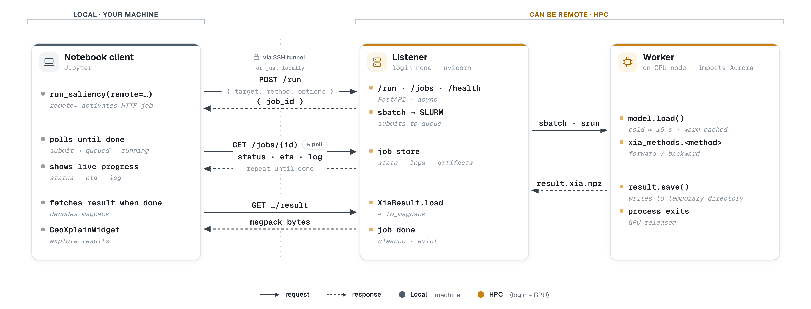

# Run the Aurora backend remotely

Remote execution is a capability of `geoxplain-aurora-adapter`, not a requirement of the GeoXplain viewer. The backend keeps local and remote Aurora computation behind the same `run_*` API. Omitting `remote` uses the current process and requires a visible GPU. Supplying a URL sends the request to an HTTP listener and polls until a result is available.



*What `remote="http://..."` sets in motion. The notebook client (left, on your machine) `POST`s a job, polls `GET /jobs/{id}` for status, ETA, and logs, then fetches packed result bytes — all over an SSH tunnel. On HPC, the listener hands the actual computation to a GPU worker through SLURM (`sbatch`/`srun`) and returns the result. Solid arrows are requests, dashed arrows are responses.*

## Start a listener

After configuring a `gpu-listener` or `login-node` setup profile:

```bash
geoxplain-aurora-adapter listen
```

If no listener config exists, `listen` stops and asks you to run setup first:

```bash
geoxplain-aurora-adapter setup --gpu-listener
# or
geoxplain-aurora-adapter setup --login-node
```

After setup, `listen` reads `~/.config/geoxplain-aurora-adapter/listen.toml`
and starts without prompts. Inspect all current overrides with:

```bash
geoxplain-aurora-adapter listen --help
```

## Call it from Python

```python
result = ax.run_saliency(
    target=target,
    input=["t", "q", "z"],
    remote="http://localhost:8765",
)
```

When direct cluster-node access is unavailable, forward a local port through SSH and keep using the local URL:

```bash
ssh -L 8765:<listener-host>:8765 <login-node>
```

## Execution modes

| Mode | Execution model |
| --- | --- |
| `local` | Model and attribution run in the calling Python process. |
| `gpu-listener` | Listener and warm model run inside an existing GPU allocation. |
| `sbatch-oneshot` | Login-node listener submits one SLURM job per request. |
| `sbatch-persistent` | Login-node listener forwards requests to a long-lived GPU worker. |

The result contract is identical in every mode. `checkpoint_path` only affects local execution; remote checkpoint selection belongs to the listener configuration.

## Retention

Two independent windows keep a long-lived listener from exhausting RAM or disk.
Both live in the `[retention]` section of `listen.toml` and can also be
overridden for one run with CLI flags:

| Setting | Covers | Default |
|---------|--------|---------|
| `memory_retention` / `--memory-retention` | Completed jobs and cached result bytes in the listener's memory | `1h` |
| `result_retention` / `--result-retention` | `sbatch-oneshot` on-disk result directories | `never` |

Memory is bounded by default. A completed job only needs to live long enough for
the client to poll and fetch it, and unbounded growth there exhausts RAM.
On-disk results are cheap, so they are kept until you opt in. Values accept
`never`, a bare number of seconds, or `<n>{s,m,h,d,w}` such as `30m`, `24h`,
`7d`, or `30d`.

```bash
geoxplain-aurora-adapter listen --memory-retention 30m --result-retention 7d
```

## Observe the listener

`GET /health` reports the resolved backend mode, model warmth, queue depth, and SLURM configuration when applicable. Submitted jobs progress through the status endpoint until the client fetches the packed result.

See the [HTTP API reference](../reference/http-api.md) when implementing a client other than `geoxplain_aurora_adapter`.
