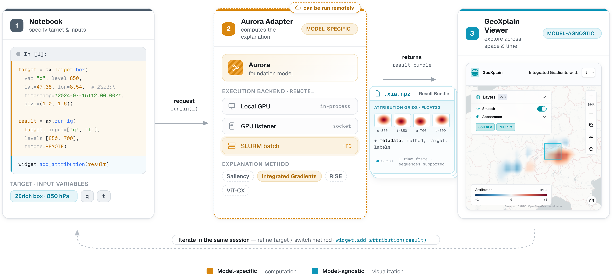

# GeoXplain


GeoXplain is a interactive Python-based visualization toolkit for exploring geospatial attribution maps across climate variables, atmospheric pressure layers, and forecast time. The `geoxplain` package accepts raw arrays or objects that satisfy its small result protocols, then lets you compare attribution methods, variables, vertical levels, and time frames in a Jupyter widget or standalone browser viewer.

Explanation computation is deliberately outside the viewer. You can use your own model and XAI library, load a saved `.xia.npz` bundle, or connect a model-specific backend. The first packaged backend is `geoxplain-aurora-adapter`, which computes explanations and weather overlays for Microsoft Aurora locally or through a remote listener.



*A single workflow in three stages. In the notebook **(1)** you specify a target and input variables. A model-specific backend such as the Aurora adapter **(2)** computes the explanation — locally, on a GPU listener, or on an HPC batch queue — and returns a self-describing `.xia.npz` result bundle. The model-agnostic GeoXplain viewer **(3)** explores that result across space, pressure levels, and forecast time. Refining the target or switching methods stays in the same notebook session.*

## Choose the right entry point

| Goal | API |
| --- | --- |
| Add an attribution from any model | `GeoXplainWidget.add_attribution()` |
| Display results in Jupyter | `geoxplain.GeoXplainWidget` |
| Open or export a standalone viewer | `geoxplain.GeoXplain` |
| Load a saved attribution bundle | `geoxplain.xia_result.load_xia_result()` |
| Load a saved overlay bundle | `geoxplain.overlay_result.load_overlay_result()` |

## Start without a backend

GeoXplain can visualize an attribution produced by any model or explanation library. No compute adapter is required:

```python
import numpy as np
from geoxplain import GeoXplainWidget

attribution = np.load("my_model_saliency.npy")

widget = GeoXplainWidget(title="Model attribution")
widget.add_attribution(
    attribution,
    level="sfc",
    method="Saliency",
    timestamp="2024-03-20T00:00:00Z",
    target=(46.25, 8.75),
)
widget
```

For several levels, variables, methods, or time frames, add more arrays or provide a `XiaResult`-compatible object. GeoXplain does not need to know which model produced them.

## End-to-end example with the Aurora backend

The optional Aurora backend adds target construction, explanation methods, data loading, and local or remote execution:

```python
import geoxplain_aurora_adapter as ax
from geoxplain import GeoXplainWidget

target = ax.Target.box(
    var="q",
    level=850,
    lat=46.25,
    lon=8.75,
    size=(1.5, 2.5),
    timestamp="2024-03-20T00:00:00Z",
)

result = ax.run_saliency(
    target=target,
    input=["t", "q", "z"],
    remote="http://localhost:8765",
)

widget = GeoXplainWidget(result=result)
widget
```

Without `remote=`, computation runs in the notebook process and requires a visible GPU. Supplying a listener URL keeps the same Python call site while moving computation to a GPU or SLURM-backed service.

## Bring your own model

The viewer works with any backend that produces compatible results, and the Aurora adapter is designed to be a template: clone it, swap the model, data loading, and targets, and keep the dispatch, remote execution, and serialization machinery. See [adapt the adapter to another model](backends/adapt-another-model.md).

## Documentation map

- Start with the [quickstart](getting-started/quickstart.md) to load an existing result.
- Use [visualize results](guides/visualize-results.md) for arrays, level mappings, result bundles, browser export, and screenshots.
- Read the [data model](concepts/data-model.md) when integrating another compute backend.
- Consult the generated [Python API reference](reference/geoxplain.md) for exact signatures.
- Read [Aurora as a backend](backends/aurora.md) before using its computation and remote-execution guides.
